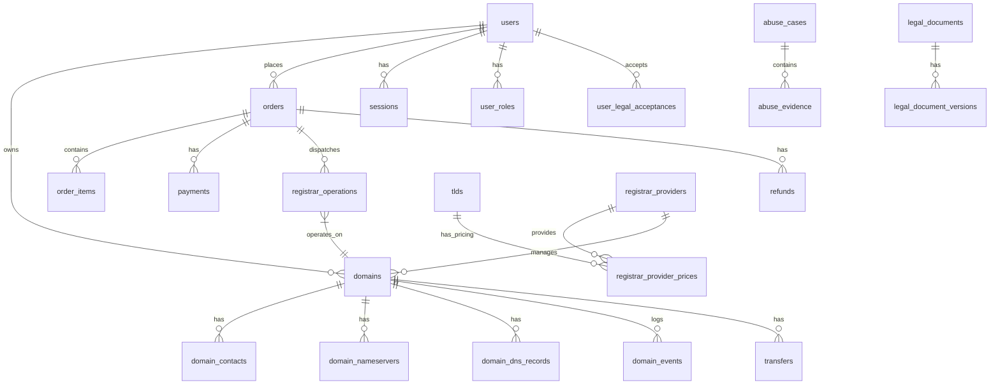

# PrisNames — Database Architecture

> **Database**: PostgreSQL  
> **ORM**: Drizzle ORM  
> **Migrations**: Tracked, non-destructive

---

## 1. Design Principles

1. **PostgreSQL is the authoritative source of truth.** Redis is cache only.
2. **Every entity owns its own status column.** No combined state machines. See ORDER_STATE_MACHINE.md.
3. **Domain lifecycle is separate from operational flags.** `lifecycle_status` is independent of `is_suspended`, `is_transfer_locked`, etc.
4. **Money is stored as integer minor units** with currency code and minor unit count.
5. **Soft-delete** via `deleted_at` / `archived_at` for financial, domain, and compliance records.
6. **No hard-delete** of domains, orders, payments, refunds, invoices, audit logs, or compliance evidence without defined retention policy.
7. **Migrations are tracked** via Drizzle. No destructive automatic schema synchronization in production.
8. **UUIDs** for primary keys (v4).

---

## 2. Entity Relationship Overview



---

## 3. Entity Definitions

### 3.1 Authentication & Users

#### `users`

| Column | Type | Constraints | Description |
|--------|------|-------------|-------------|
| `id` | UUID | PK | |
| `email` | VARCHAR(255) | UNIQUE, NOT NULL | Primary login identifier |
| `email_verified` | BOOLEAN | NOT NULL, DEFAULT false | |
| `display_name` | VARCHAR(100) | | User-chosen display name |
| `account_status` | VARCHAR(20) | NOT NULL, DEFAULT 'ACTIVE' | ACTIVE, DISABLED, SUSPENDED |
| `disabled_at` | TIMESTAMPTZ | | |
| `disabled_reason` | TEXT | | |
| `created_at` | TIMESTAMPTZ | NOT NULL, DEFAULT now() | |
| `updated_at` | TIMESTAMPTZ | NOT NULL, DEFAULT now() | |
| `deleted_at` | TIMESTAMPTZ | | Soft delete |

#### `user_profiles`

| Column | Type | Constraints | Description |
|--------|------|-------------|-------------|
| `id` | UUID | PK | |
| `user_id` | UUID | FK → users, UNIQUE | 1:1 with users |
| `first_name` | VARCHAR(100) | | |
| `last_name` | VARCHAR(100) | | |
| `company` | VARCHAR(200) | | |
| `phone` | VARCHAR(30) | | |
| `country` | CHAR(2) | | ISO 3166-1 alpha-2 |
| `timezone` | VARCHAR(50) | | IANA timezone |
| `created_at` | TIMESTAMPTZ | NOT NULL | |
| `updated_at` | TIMESTAMPTZ | NOT NULL | |

#### `auth_identities`

Supports future OAuth providers without rebuilding the account model.

| Column | Type | Constraints | Description |
|--------|------|-------------|-------------|
| `id` | UUID | PK | |
| `user_id` | UUID | FK → users, NOT NULL | |
| `provider` | VARCHAR(20) | NOT NULL | 'email', future: 'google', 'github', 'apple' |
| `provider_id` | VARCHAR(255) | NOT NULL | Email address or OAuth provider user ID |
| `created_at` | TIMESTAMPTZ | NOT NULL | |
| | | UNIQUE(provider, provider_id) | |

#### `password_credentials`

| Column | Type | Constraints | Description |
|--------|------|-------------|-------------|
| `id` | UUID | PK | |
| `user_id` | UUID | FK → users, UNIQUE | 1:1 |
| `password_hash` | VARCHAR(255) | NOT NULL | Argon2id hash |
| `changed_at` | TIMESTAMPTZ | NOT NULL | Last password change |
| `created_at` | TIMESTAMPTZ | NOT NULL | |

#### `email_verifications`

| Column | Type | Constraints | Description |
|--------|------|-------------|-------------|
| `id` | UUID | PK | |
| `user_id` | UUID | FK → users, NOT NULL | |
| `otp_hash` | VARCHAR(255) | NOT NULL | Hashed OTP (never plaintext) |
| `method` | VARCHAR(10) | NOT NULL | 'otp' or 'link' |
| `expires_at` | TIMESTAMPTZ | NOT NULL | Configurable, default 10 minutes |
| `attempts` | INTEGER | NOT NULL, DEFAULT 0 | Max attempts enforced |
| `verified_at` | TIMESTAMPTZ | | Null until verified |
| `invalidated` | BOOLEAN | NOT NULL, DEFAULT false | Previous OTP invalidated on resend |
| `created_at` | TIMESTAMPTZ | NOT NULL | |

#### `password_resets`

| Column | Type | Constraints | Description |
|--------|------|-------------|-------------|
| `id` | UUID | PK | |
| `user_id` | UUID | FK → users, NOT NULL | |
| `token_hash` | VARCHAR(255) | NOT NULL | Hashed reset token |
| `expires_at` | TIMESTAMPTZ | NOT NULL | Short-lived |
| `used_at` | TIMESTAMPTZ | | Single-use |
| `created_at` | TIMESTAMPTZ | NOT NULL | |

#### `sessions`

| Column | Type | Constraints | Description |
|--------|------|-------------|-------------|
| `id` | UUID | PK | Session identifier (stored in cookie) |
| `user_id` | UUID | FK → users, NOT NULL | |
| `ip_address` | VARCHAR(45) | | IPv4 or IPv6 |
| `user_agent` | TEXT | | |
| `last_active_at` | TIMESTAMPTZ | NOT NULL | |
| `expires_at` | TIMESTAMPTZ | NOT NULL | |
| `revoked_at` | TIMESTAMPTZ | | |
| `created_at` | TIMESTAMPTZ | NOT NULL | |

#### `roles`

| Column | Type | Constraints | Description |
|--------|------|-------------|-------------|
| `id` | UUID | PK | |
| `name` | VARCHAR(30) | UNIQUE, NOT NULL | USER, SUPPORT, FINANCE, ABUSE, ADMIN, SUPER_ADMIN |
| `description` | TEXT | | |
| `created_at` | TIMESTAMPTZ | NOT NULL | |

#### `user_roles`

| Column | Type | Constraints | Description |
|--------|------|-------------|-------------|
| `id` | UUID | PK | |
| `user_id` | UUID | FK → users, NOT NULL | |
| `role_id` | UUID | FK → roles, NOT NULL | |
| `assigned_by` | UUID | FK → users | Who assigned this role |
| `created_at` | TIMESTAMPTZ | NOT NULL | |
| | | UNIQUE(user_id, role_id) | |

---

### 3.2 Domains

#### `domains`

| Column | Type | Constraints | Description |
|--------|------|-------------|-------------|
| `id` | UUID | PK | |
| `user_id` | UUID | FK → users, NOT NULL | Domain owner |
| `fqdn` | VARCHAR(255) | UNIQUE, NOT NULL | Fully qualified domain name (normalized) |
| `sld` | VARCHAR(200) | NOT NULL | Second-level domain |
| `tld` | VARCHAR(50) | NOT NULL | Top-level domain |
| `lifecycle_status` | VARCHAR(30) | NOT NULL, DEFAULT 'PENDING_REGISTRATION' | See ORDER_STATE_MACHINE.md §1.5 |
| `is_suspended` | BOOLEAN | NOT NULL, DEFAULT false | Independent operational flag |
| `suspension_type` | VARCHAR(50) | | abuse, legal, compliance, registrar_hold |
| `suspension_reason` | TEXT | | |
| `suspended_at` | TIMESTAMPTZ | | |
| `is_transfer_locked` | BOOLEAN | NOT NULL, DEFAULT true | EPP transfer lock |
| `transfer_lock_updated_at` | TIMESTAMPTZ | | |
| `privacy_level` | VARCHAR(20) | | none, partial, full |
| `privacy_updated_at` | TIMESTAMPTZ | | |
| `auto_renew_enabled` | BOOLEAN | NOT NULL, DEFAULT false | |
| `renew_option` | VARCHAR(30) | | Dynadot renew_option value |
| `registrar_hold` | BOOLEAN | NOT NULL, DEFAULT false | Reseller hold at Dynadot |
| `provider_status` | VARCHAR(50) | | Raw Dynadot status string |
| `provider_expiration_info` | JSONB | | Raw expiration data from DOMAIN_EXPIRING webhook |
| `registrar_provider_id` | UUID | FK → registrar_providers, NOT NULL | |
| `provider_domain_id` | VARCHAR(255) | | Dynadot internal domain identifier |
| `registered_at` | TIMESTAMPTZ | | |
| `expires_at` | TIMESTAMPTZ | | |
| `created_at` | TIMESTAMPTZ | NOT NULL | |
| `updated_at` | TIMESTAMPTZ | NOT NULL | |
| `deleted_at` | TIMESTAMPTZ | | Soft delete |

**Lifecycle Status Values**: PENDING_REGISTRATION, ACTIVE, INACTIVE, EXPIRED, REDEMPTION, PENDING_DELETE, DELETED, REGISTRATION_FAILED

#### `domain_contacts`

| Column | Type | Constraints | Description |
|--------|------|-------------|-------------|
| `id` | UUID | PK | |
| `domain_id` | UUID | FK → domains, NOT NULL | |
| `contact_type` | VARCHAR(20) | NOT NULL | registrant, admin, tech, billing |
| `first_name` | VARCHAR(100) | | Encrypted |
| `last_name` | VARCHAR(100) | | Encrypted |
| `company` | VARCHAR(200) | | |
| `email` | VARCHAR(255) | | Encrypted |
| `phone` | VARCHAR(30) | | Encrypted |
| `address_line1` | VARCHAR(255) | | Encrypted |
| `address_line2` | VARCHAR(255) | | Encrypted |
| `city` | VARCHAR(100) | | |
| `state` | VARCHAR(100) | | |
| `postal_code` | VARCHAR(20) | | |
| `country` | CHAR(2) | | ISO 3166-1 alpha-2 |
| `provider_contact_id` | VARCHAR(255) | | Dynadot contact ID |
| `created_at` | TIMESTAMPTZ | NOT NULL | |
| `updated_at` | TIMESTAMPTZ | NOT NULL | |

**PII Handling**: Sensitive fields (name, email, phone, address) are encrypted at the application level using AES-256-GCM. The encryption key is managed separately from database credentials.

#### `domain_nameservers`

| Column | Type | Constraints | Description |
|--------|------|-------------|-------------|
| `id` | UUID | PK | |
| `domain_id` | UUID | FK → domains, NOT NULL | |
| `hostname` | VARCHAR(255) | NOT NULL | Nameserver hostname |
| `sort_order` | INTEGER | NOT NULL | Ordering |
| `created_at` | TIMESTAMPTZ | NOT NULL | |
| `updated_at` | TIMESTAMPTZ | NOT NULL | |

#### `domain_dns_records`

| Column | Type | Constraints | Description |
|--------|------|-------------|-------------|
| `id` | UUID | PK | |
| `domain_id` | UUID | FK → domains, NOT NULL | |
| `record_type` | VARCHAR(10) | NOT NULL | A, AAAA, CNAME, MX, TXT, NS, SRV, etc. |
| `hostname` | VARCHAR(255) | NOT NULL | Record hostname |
| `value` | TEXT | NOT NULL | Record value |
| `ttl` | INTEGER | NOT NULL, DEFAULT 3600 | TTL in seconds |
| `priority` | INTEGER | | MX/SRV priority |
| `created_at` | TIMESTAMPTZ | NOT NULL | |
| `updated_at` | TIMESTAMPTZ | NOT NULL | |

#### `domain_events`

Immutable log of significant domain events (not audit_logs — these are domain-specific lifecycle events).

| Column | Type | Constraints | Description |
|--------|------|-------------|-------------|
| `id` | UUID | PK | |
| `domain_id` | UUID | FK → domains, NOT NULL | |
| `event_type` | VARCHAR(50) | NOT NULL | REGISTERED, RENEWED, TRANSFERRED_IN, etc. |
| `event_data` | JSONB | | Event-specific data |
| `source` | VARCHAR(20) | NOT NULL | api, webhook, reconciliation, admin |
| `created_at` | TIMESTAMPTZ | NOT NULL | |

---

### 3.3 Registrar

#### `registrar_providers`

| Column | Type | Constraints | Description |
|--------|------|-------------|-------------|
| `id` | UUID | PK | |
| `provider_id` | VARCHAR(30) | UNIQUE, NOT NULL | 'dynadot', future: 'openprovider', etc. |
| `provider_name` | VARCHAR(100) | NOT NULL | 'Dynadot (GDG)' |
| `is_active` | BOOLEAN | NOT NULL, DEFAULT true | |
| `config` | JSONB | | Provider-specific configuration (non-secret) |
| `created_at` | TIMESTAMPTZ | NOT NULL | |
| `updated_at` | TIMESTAMPTZ | NOT NULL | |

#### `registrar_operations`

| Column | Type | Constraints | Description |
|--------|------|-------------|-------------|
| `id` | UUID | PK | |
| `order_id` | UUID | FK → orders | |
| `order_item_id` | UUID | FK → order_items | |
| `domain_id` | UUID | FK → domains | |
| `registrar_provider_id` | UUID | FK → registrar_providers, NOT NULL | |
| `status` | VARCHAR(20) | NOT NULL, DEFAULT 'QUEUED' | See ORDER_STATE_MACHINE.md §1.4 |
| `operation_type` | VARCHAR(30) | NOT NULL | REGISTER, RENEW, TRANSFER_IN, RESTORE, SET_CONTACTS, SET_NAMESERVERS, etc. |
| `provider_request_id` | UUID | | X-Request-ID sent to Dynadot |
| `provider_order_id` | INTEGER | | Dynadot's order_id |
| `provider_response_code` | INTEGER | | HTTP status code |
| `provider_response_raw` | BYTEA | | Encrypted raw response |
| `retry_count` | INTEGER | NOT NULL, DEFAULT 0 | |
| `max_retries` | INTEGER | NOT NULL, DEFAULT 3 | |
| `last_error` | TEXT | | Last error message |
| `started_at` | TIMESTAMPTZ | | When processing began |
| `completed_at` | TIMESTAMPTZ | | When terminal state reached |
| `created_at` | TIMESTAMPTZ | NOT NULL | |
| `updated_at` | TIMESTAMPTZ | NOT NULL | |

**Status Values**: QUEUED, PROCESSING, ACCEPTED, SUCCEEDED, UNKNOWN, RETRY_PENDING, FAILED, MANUAL_REVIEW, CANCELLED

#### `transfers`

| Column | Type | Constraints | Description |
|--------|------|-------------|-------------|
| `id` | UUID | PK | |
| `domain_id` | UUID | FK → domains | |
| `order_id` | UUID | FK → orders | |
| `registrar_operation_id` | UUID | FK → registrar_operations | |
| `status` | VARCHAR(30) | NOT NULL, DEFAULT 'INITIATED' | |
| `direction` | VARCHAR(10) | NOT NULL | 'IN' or 'OUT' |
| `auth_code_hash` | VARCHAR(255) | | Hashed, never plaintext |
| `gaining_registrar` | VARCHAR(100) | | For outgoing transfers |
| `initiated_at` | TIMESTAMPTZ | NOT NULL | |
| `completed_at` | TIMESTAMPTZ | | |
| `failed_reason` | TEXT | | |
| `created_at` | TIMESTAMPTZ | NOT NULL | |
| `updated_at` | TIMESTAMPTZ | NOT NULL | |

**Status Values**: INITIATED, AUTH_CODE_SUBMITTED, PENDING_APPROVAL, PROCESSING, COMPLETED, FAILED, CANCELLED

---

### 3.4 Pricing

#### `tlds`

| Column | Type | Constraints | Description |
|--------|------|-------------|-------------|
| `id` | UUID | PK | |
| `tld` | VARCHAR(50) | UNIQUE, NOT NULL | e.g., 'com', 'net', 'io' |
| `is_enabled` | BOOLEAN | NOT NULL, DEFAULT false | Available for customer purchase |
| `supports_privacy` | BOOLEAN | NOT NULL, DEFAULT false | |
| `supports_transfer_lock` | BOOLEAN | NOT NULL, DEFAULT true | |
| `supports_dnssec` | BOOLEAN | NOT NULL, DEFAULT false | |
| `min_registration_years` | INTEGER | NOT NULL, DEFAULT 1 | |
| `max_registration_years` | INTEGER | NOT NULL, DEFAULT 10 | |
| `is_premium_supported` | BOOLEAN | NOT NULL, DEFAULT false | |
| `created_at` | TIMESTAMPTZ | NOT NULL | |
| `updated_at` | TIMESTAMPTZ | NOT NULL | |

#### `registrar_provider_prices`

| Column | Type | Constraints | Description |
|--------|------|-------------|-------------|
| `id` | UUID | PK | |
| `tld_id` | UUID | FK → tlds, NOT NULL | |
| `registrar_provider_id` | UUID | FK → registrar_providers, NOT NULL | |
| `operation` | VARCHAR(20) | NOT NULL | register, renew, transfer, restore |
| `years` | INTEGER | NOT NULL, DEFAULT 1 | Registration period |
| `provider_cost_amount` | INTEGER | NOT NULL | Provider cost in minor units |
| `provider_cost_currency` | VARCHAR(3) | NOT NULL | ISO 4217 |
| `retail_price_amount` | INTEGER | NOT NULL | Customer retail price in minor units |
| `retail_price_currency` | VARCHAR(3) | NOT NULL | ISO 4217 |
| `markup_type` | VARCHAR(10) | | 'fixed', 'percentage' |
| `markup_value` | INTEGER | | Markup amount |
| `is_promotion` | BOOLEAN | NOT NULL, DEFAULT false | |
| `promotion_price_amount` | INTEGER | | Promotional price |
| `promotion_starts_at` | TIMESTAMPTZ | | |
| `promotion_ends_at` | TIMESTAMPTZ | | |
| `last_synced_at` | TIMESTAMPTZ | | Last sync from Dynadot |
| `created_at` | TIMESTAMPTZ | NOT NULL | |
| `updated_at` | TIMESTAMPTZ | NOT NULL | |
| | | UNIQUE(tld_id, registrar_provider_id, operation, years) | |

---

### 3.5 Commerce

#### `quotes`

| Column | Type | Constraints | Description |
|--------|------|-------------|-------------|
| `id` | UUID | PK | |
| `user_id` | UUID | FK → users, NOT NULL | |
| `domain` | VARCHAR(255) | NOT NULL | FQDN |
| `operation` | VARCHAR(20) | NOT NULL | register, renew, transfer |
| `years` | INTEGER | NOT NULL, DEFAULT 1 | |
| `retail_amount` | INTEGER | NOT NULL | Minor units |
| `currency` | VARCHAR(3) | NOT NULL | |
| `provider_cost_amount` | INTEGER | NOT NULL | Estimated provider cost |
| `is_premium` | BOOLEAN | NOT NULL, DEFAULT false | |
| `registrar_provider_id` | UUID | FK → registrar_providers, NOT NULL | |
| `expires_at` | TIMESTAMPTZ | NOT NULL | Quote validity window |
| `created_at` | TIMESTAMPTZ | NOT NULL | |

#### `orders`

| Column | Type | Constraints | Description |
|--------|------|-------------|-------------|
| `id` | UUID | PK | |
| `user_id` | UUID | FK → users, NOT NULL | |
| `status` | VARCHAR(30) | NOT NULL, DEFAULT 'DRAFT' | See ORDER_STATE_MACHINE.md §1.1 |
| `currency` | VARCHAR(3) | NOT NULL | |
| `subtotal` | INTEGER | NOT NULL, DEFAULT 0 | Minor units |
| `tax` | INTEGER | NOT NULL, DEFAULT 0 | Minor units |
| `discount` | INTEGER | NOT NULL, DEFAULT 0 | Minor units |
| `total` | INTEGER | NOT NULL, DEFAULT 0 | Minor units |
| `created_at` | TIMESTAMPTZ | NOT NULL | |
| `updated_at` | TIMESTAMPTZ | NOT NULL | |
| `completed_at` | TIMESTAMPTZ | | |

**Status Values**: DRAFT, PENDING_PAYMENT, PROCESSING, COMPLETED, FAILED, CANCELLED, REFUND_REQUIRED, REFUND_PENDING, REFUNDED, PARTIALLY_REFUNDED

#### `order_items`

| Column | Type | Constraints | Description |
|--------|------|-------------|-------------|
| `id` | UUID | PK | |
| `order_id` | UUID | FK → orders, NOT NULL | |
| `domain` | VARCHAR(255) | NOT NULL | |
| `operation` | VARCHAR(20) | NOT NULL | register, renew, transfer, restore |
| `years` | INTEGER | NOT NULL | |
| `amount` | INTEGER | NOT NULL | Minor units |
| `currency` | VARCHAR(3) | NOT NULL | |
| `is_premium` | BOOLEAN | NOT NULL, DEFAULT false | |
| `quote_id` | UUID | FK → quotes | Price snapshot origin |
| `registrar_provider_id` | UUID | FK → registrar_providers, NOT NULL | |
| `provider_cost_amount` | INTEGER | NOT NULL | Provider cost snapshot |
| `created_at` | TIMESTAMPTZ | NOT NULL | |

#### `payments`

| Column | Type | Constraints | Description |
|--------|------|-------------|-------------|
| `id` | UUID | PK | |
| `order_id` | UUID | FK → orders, NOT NULL | |
| `status` | VARCHAR(20) | NOT NULL, DEFAULT 'CREATED' | See ORDER_STATE_MACHINE.md §1.2 |
| `payment_provider_id` | VARCHAR(30) | | 'phonepe', 'triple_a', 'coingate' |
| `provider_payment_id` | VARCHAR(255) | | Gateway transaction ID |
| `amount` | INTEGER | NOT NULL | Minor units |
| `currency` | VARCHAR(3) | NOT NULL | |
| `method` | VARCHAR(30) | | card, upi, crypto, etc. |
| `gateway_response` | BYTEA | | Encrypted gateway response |
| `paid_at` | TIMESTAMPTZ | | |
| `created_at` | TIMESTAMPTZ | NOT NULL | |
| `updated_at` | TIMESTAMPTZ | NOT NULL | |

**Status Values**: CREATED, PENDING, PROCESSING, SUCCEEDED, FAILED, EXPIRED, CANCELLED

#### `payment_attempts`

| Column | Type | Constraints | Description |
|--------|------|-------------|-------------|
| `id` | UUID | PK | |
| `payment_id` | UUID | FK → payments, NOT NULL | |
| `attempt_number` | INTEGER | NOT NULL | |
| `status` | VARCHAR(20) | NOT NULL | |
| `gateway_response_code` | VARCHAR(50) | | |
| `error_message` | TEXT | | |
| `created_at` | TIMESTAMPTZ | NOT NULL | |

#### `refunds`

| Column | Type | Constraints | Description |
|--------|------|-------------|-------------|
| `id` | UUID | PK | |
| `order_id` | UUID | FK → orders, NOT NULL | |
| `payment_id` | UUID | FK → payments, NOT NULL | |
| `status` | VARCHAR(20) | NOT NULL, DEFAULT 'CREATED' | See ORDER_STATE_MACHINE.md §1.3 |
| `amount` | INTEGER | NOT NULL | Minor units |
| `currency` | VARCHAR(3) | NOT NULL | |
| `reason` | TEXT | NOT NULL | |
| `provider_refund_id` | VARCHAR(255) | | Gateway refund transaction ID |
| `initiated_by` | UUID | FK → users | Admin who initiated |
| `completed_at` | TIMESTAMPTZ | | |
| `created_at` | TIMESTAMPTZ | NOT NULL | |
| `updated_at` | TIMESTAMPTZ | NOT NULL | |

**Status Values**: CREATED, PENDING, PROCESSING, COMPLETED, FAILED, CANCELLED

#### `invoices`

| Column | Type | Constraints | Description |
|--------|------|-------------|-------------|
| `id` | UUID | PK | |
| `order_id` | UUID | FK → orders, NOT NULL | |
| `user_id` | UUID | FK → users, NOT NULL | |
| `invoice_number` | VARCHAR(50) | UNIQUE, NOT NULL | Sequential, human-readable |
| `amount` | INTEGER | NOT NULL | Minor units |
| `tax` | INTEGER | NOT NULL, DEFAULT 0 | |
| `total` | INTEGER | NOT NULL | |
| `currency` | VARCHAR(3) | NOT NULL | |
| `status` | VARCHAR(20) | NOT NULL | DRAFT, ISSUED, PAID, VOID, REFUNDED |
| `issued_at` | TIMESTAMPTZ | | |
| `paid_at` | TIMESTAMPTZ | | |
| `created_at` | TIMESTAMPTZ | NOT NULL | |

---

### 3.6 Compliance & Legal

#### `audit_logs`

| Column | Type | Constraints | Description |
|--------|------|-------------|-------------|
| `id` | UUID | PK | |
| `actor_id` | UUID | FK → users | Who performed the action (null for system) |
| `actor_type` | VARCHAR(20) | NOT NULL | 'user', 'admin', 'system', 'webhook' |
| `action` | VARCHAR(100) | NOT NULL | e.g., 'domain.registered', 'user.login' |
| `resource_type` | VARCHAR(50) | NOT NULL | 'domain', 'order', 'user', etc. |
| `resource_id` | UUID | | |
| `request_id` | UUID | | Correlation ID |
| `ip_address` | VARCHAR(45) | | |
| `user_agent` | TEXT | | |
| `metadata` | JSONB | | Action-specific data |
| `before_state` | JSONB | | Previous state (for updates) |
| `after_state` | JSONB | | New state (for updates) |
| `created_at` | TIMESTAMPTZ | NOT NULL | |

#### `admin_actions`

| Column | Type | Constraints | Description |
|--------|------|-------------|-------------|
| `id` | UUID | PK | |
| `admin_id` | UUID | FK → users, NOT NULL | |
| `action` | VARCHAR(100) | NOT NULL | |
| `target_type` | VARCHAR(50) | NOT NULL | |
| `target_id` | UUID | | |
| `reason` | TEXT | | Required for sensitive actions |
| `request_id` | UUID | | |
| `created_at` | TIMESTAMPTZ | NOT NULL | |

#### `abuse_cases`

| Column | Type | Constraints | Description |
|--------|------|-------------|-------------|
| `id` | UUID | PK | |
| `domain_id` | UUID | FK → domains | |
| `reporter_email` | VARCHAR(255) | | |
| `category` | VARCHAR(30) | NOT NULL | PHISHING, MALWARE, FINANCIAL_FRAUD, IMPERSONATION, SPAM, TRADEMARK, ILLEGAL_CONTENT, OTHER |
| `status` | VARCHAR(30) | NOT NULL, DEFAULT 'OPEN' | OPEN, UNDER_REVIEW, AWAITING_INFORMATION, ACTION_REQUIRED, ESCALATED_TO_REGISTRAR, SUSPENDED, RESOLVED, REJECTED |
| `description` | TEXT | | |
| `internal_notes` | TEXT | | |
| `assigned_to` | UUID | FK → users | Admin handling the case |
| `escalated_at` | TIMESTAMPTZ | | |
| `resolved_at` | TIMESTAMPTZ | | |
| `created_at` | TIMESTAMPTZ | NOT NULL | |
| `updated_at` | TIMESTAMPTZ | NOT NULL | |

#### `abuse_evidence`

| Column | Type | Constraints | Description |
|--------|------|-------------|-------------|
| `id` | UUID | PK | |
| `abuse_case_id` | UUID | FK → abuse_cases, NOT NULL | |
| `evidence_type` | VARCHAR(30) | NOT NULL | screenshot, email, url, document |
| `description` | TEXT | | |
| `file_path` | VARCHAR(500) | | Stored file reference |
| `submitted_by` | UUID | FK → users | |
| `created_at` | TIMESTAMPTZ | NOT NULL | |

#### `compliance_cases`

| Column | Type | Constraints | Description |
|--------|------|-------------|-------------|
| `id` | UUID | PK | |
| `case_type` | VARCHAR(30) | NOT NULL | data_request, legal_request, dmca, udrp |
| `status` | VARCHAR(30) | NOT NULL | OPEN, IN_PROGRESS, RESPONDED, CLOSED |
| `description` | TEXT | | |
| `domain_id` | UUID | FK → domains | |
| `user_id` | UUID | FK → users | |
| `assigned_to` | UUID | FK → users | |
| `due_date` | TIMESTAMPTZ | | |
| `created_at` | TIMESTAMPTZ | NOT NULL | |
| `updated_at` | TIMESTAMPTZ | NOT NULL | |

#### `legal_requests`

| Column | Type | Constraints | Description |
|--------|------|-------------|-------------|
| `id` | UUID | PK | |
| `request_type` | VARCHAR(30) | NOT NULL | subpoena, court_order, law_enforcement |
| `requesting_authority` | VARCHAR(255) | NOT NULL | |
| `description` | TEXT | | |
| `compliance_case_id` | UUID | FK → compliance_cases | |
| `received_at` | TIMESTAMPTZ | NOT NULL | |
| `response_deadline` | TIMESTAMPTZ | | |
| `responded_at` | TIMESTAMPTZ | | |
| `created_at` | TIMESTAMPTZ | NOT NULL | |

#### `data_disclosures`

| Column | Type | Constraints | Description |
|--------|------|-------------|-------------|
| `id` | UUID | PK | |
| `user_id` | UUID | FK → users | |
| `domain_id` | UUID | FK → domains | |
| `legal_request_id` | UUID | FK → legal_requests | |
| `disclosed_to` | VARCHAR(255) | NOT NULL | |
| `data_categories` | TEXT[] | NOT NULL | What data was disclosed |
| `disclosed_by` | UUID | FK → users, NOT NULL | Admin who authorized |
| `created_at` | TIMESTAMPTZ | NOT NULL | |

#### `legal_documents`

| Column | Type | Constraints | Description |
|--------|------|-------------|-------------|
| `id` | UUID | PK | |
| `slug` | VARCHAR(50) | UNIQUE, NOT NULL | 'terms-of-service', 'privacy-policy', 'registration-agreement' |
| `title` | VARCHAR(200) | NOT NULL | |
| `is_required` | BOOLEAN | NOT NULL, DEFAULT true | Must be accepted for registration |
| `created_at` | TIMESTAMPTZ | NOT NULL | |
| `updated_at` | TIMESTAMPTZ | NOT NULL | |

#### `legal_document_versions`

| Column | Type | Constraints | Description |
|--------|------|-------------|-------------|
| `id` | UUID | PK | |
| `legal_document_id` | UUID | FK → legal_documents, NOT NULL | |
| `version` | VARCHAR(20) | NOT NULL | '1.0', '1.1', '2.0' |
| `content_hash` | VARCHAR(64) | NOT NULL | SHA-256 of content |
| `content_url` | VARCHAR(500) | NOT NULL | URL to the document |
| `effective_at` | TIMESTAMPTZ | NOT NULL | When this version becomes active |
| `is_active` | BOOLEAN | NOT NULL, DEFAULT false | |
| `created_at` | TIMESTAMPTZ | NOT NULL | |

#### `user_legal_acceptances`

| Column | Type | Constraints | Description |
|--------|------|-------------|-------------|
| `id` | UUID | PK | |
| `user_id` | UUID | FK → users, NOT NULL | |
| `legal_document_version_id` | UUID | FK → legal_document_versions, NOT NULL | |
| `order_id` | UUID | FK → orders | If accepted during purchase |
| `domain` | VARCHAR(255) | | If domain-specific |
| `ip_address` | VARCHAR(45) | | |
| `accepted_at` | TIMESTAMPTZ | NOT NULL | |

---

### 3.7 Operations

#### `email_logs`

| Column | Type | Constraints | Description |
|--------|------|-------------|-------------|
| `id` | UUID | PK | |
| `user_id` | UUID | FK → users | |
| `to_email` | VARCHAR(255) | NOT NULL | |
| `template` | VARCHAR(50) | NOT NULL | Template identifier |
| `subject` | VARCHAR(255) | NOT NULL | |
| `status` | VARCHAR(20) | NOT NULL | QUEUED, SENT, DELIVERED, BOUNCED, FAILED |
| `provider` | VARCHAR(30) | | Email provider used |
| `provider_message_id` | VARCHAR(255) | | |
| `error` | TEXT | | |
| `sent_at` | TIMESTAMPTZ | | |
| `created_at` | TIMESTAMPTZ | NOT NULL | |

#### `webhook_events`

| Column | Type | Constraints | Description |
|--------|------|-------------|-------------|
| `id` | UUID | PK | |
| `event_id` | VARCHAR(100) | UNIQUE, NOT NULL | Provider's event_id (dedup key) |
| `event_type` | VARCHAR(50) | NOT NULL | |
| `provider` | VARCHAR(20) | NOT NULL, DEFAULT 'dynadot' | |
| `received_at` | TIMESTAMPTZ | NOT NULL | |
| `processed_at` | TIMESTAMPTZ | | |
| `processing_status` | VARCHAR(20) | NOT NULL, DEFAULT 'PENDING' | PENDING, PROCESSING, COMPLETED, FAILED |
| `processing_error` | TEXT | | |
| `raw_payload` | BYTEA | NOT NULL | Encrypted, NOT plaintext |
| `raw_payload_expires_at` | TIMESTAMPTZ | NOT NULL | Retention enforcement (90 days default) |
| `signature_valid` | BOOLEAN | NOT NULL | |
| `created_at` | TIMESTAMPTZ | NOT NULL | |

#### `job_records`

| Column | Type | Constraints | Description |
|--------|------|-------------|-------------|
| `id` | UUID | PK | |
| `queue_name` | VARCHAR(50) | NOT NULL | |
| `job_id` | VARCHAR(100) | NOT NULL | BullMQ job ID |
| `status` | VARCHAR(20) | NOT NULL | QUEUED, ACTIVE, COMPLETED, FAILED |
| `payload_summary` | JSONB | | Non-sensitive job metadata |
| `error` | TEXT | | |
| `started_at` | TIMESTAMPTZ | | |
| `completed_at` | TIMESTAMPTZ | | |
| `created_at` | TIMESTAMPTZ | NOT NULL | |

#### `feature_flags`

| Column | Type | Constraints | Description |
|--------|------|-------------|-------------|
| `id` | UUID | PK | |
| `key` | VARCHAR(50) | UNIQUE, NOT NULL | Flag identifier |
| `value` | BOOLEAN | NOT NULL, DEFAULT false | |
| `description` | TEXT | | |
| `updated_by` | UUID | FK → users | |
| `created_at` | TIMESTAMPTZ | NOT NULL | |
| `updated_at` | TIMESTAMPTZ | NOT NULL | |

#### `system_settings`

| Column | Type | Constraints | Description |
|--------|------|-------------|-------------|
| `id` | UUID | PK | |
| `key` | VARCHAR(100) | UNIQUE, NOT NULL | Setting key |
| `value` | TEXT | NOT NULL | Setting value (string-encoded) |
| `value_type` | VARCHAR(20) | NOT NULL | 'string', 'integer', 'boolean', 'json' |
| `description` | TEXT | | |
| `updated_by` | UUID | FK → users | |
| `created_at` | TIMESTAMPTZ | NOT NULL | |
| `updated_at` | TIMESTAMPTZ | NOT NULL | |

---

## 4. Index Strategy

```sql
-- Users
CREATE UNIQUE INDEX idx_users_email ON users(email);

-- Domains
CREATE UNIQUE INDEX idx_domains_fqdn ON domains(fqdn);
CREATE INDEX idx_domains_user_id ON domains(user_id);
CREATE INDEX idx_domains_expires_at ON domains(expires_at);
CREATE INDEX idx_domains_lifecycle_status ON domains(lifecycle_status);
CREATE INDEX idx_domains_registrar_provider_id ON domains(registrar_provider_id);

-- Orders
CREATE INDEX idx_orders_user_id ON orders(user_id);
CREATE INDEX idx_orders_status ON orders(status);

-- Payments
CREATE INDEX idx_payments_order_id ON payments(order_id);
CREATE INDEX idx_payments_status ON payments(status);

-- Registrar Operations
CREATE INDEX idx_reg_ops_order_id ON registrar_operations(order_id);
CREATE INDEX idx_reg_ops_domain_id ON registrar_operations(domain_id);
CREATE INDEX idx_reg_ops_status ON registrar_operations(status);
CREATE INDEX idx_reg_ops_provider_order_id ON registrar_operations(provider_order_id);

-- Quotes
CREATE INDEX idx_quotes_expires_at ON quotes(expires_at);
CREATE INDEX idx_quotes_user_id ON quotes(user_id);

-- Transfers
CREATE INDEX idx_transfers_domain_id ON transfers(domain_id);
CREATE INDEX idx_transfers_status ON transfers(status);

-- Audit
CREATE INDEX idx_audit_logs_actor_id ON audit_logs(actor_id);
CREATE INDEX idx_audit_logs_resource ON audit_logs(resource_type, resource_id);
CREATE INDEX idx_audit_logs_created_at ON audit_logs(created_at);

-- Abuse
CREATE INDEX idx_abuse_cases_status ON abuse_cases(status);
CREATE INDEX idx_abuse_cases_domain_id ON abuse_cases(domain_id);

-- Webhook Events
CREATE UNIQUE INDEX idx_webhook_events_event_id ON webhook_events(event_id);
CREATE INDEX idx_webhook_events_expiry ON webhook_events(raw_payload_expires_at)
    WHERE raw_payload IS NOT NULL;

-- Sessions
CREATE INDEX idx_sessions_user_id ON sessions(user_id);

-- TLD Pricing
CREATE UNIQUE INDEX idx_provider_prices_unique
    ON registrar_provider_prices(tld_id, registrar_provider_id, operation, years);
```

---

## 5. Money Representation

All monetary amounts are stored as **integer minor units** with explicit currency:

```
amount = 1299      → $12.99 (USD, minor unit = 2)
amount = 129900    → ₹1,299.00 (INR, minor unit = 2)
```

| Column | Type | Description |
|--------|------|-------------|
| `amount` | INTEGER | Amount in minor units |
| `currency` | VARCHAR(3) | ISO 4217 currency code |

Never use floating-point for money. All arithmetic uses integer operations. Display formatting is a presentation concern.

---

## 6. Migration Strategy

### 6.1 Workflow

Generated migration SQL files are the **single source of truth** for schema changes:

```
Schema code change
  → pnpm db:generate     (generate migration SQL via drizzle-kit)
  → Review generated SQL  (human-inspected before merge)
  → pnpm db:migrate       (apply to target database)
```

Never use `drizzle-kit push` for staging or production deployments. Push is acceptable only during early local development when rapid iteration is needed and data loss is tolerable.

### 6.2 Rules

1. Migrations are tracked in version control (`packages/database/drizzle/`).
2. Schema changes are reviewed before migration application.
3. Backward-compatible changes preferred (add columns with defaults, not remove columns).
4. No destructive automatic synchronization in production.
5. All VARCHAR status columns have CHECK constraints to prevent invalid database state.
6. All monetary columns use BIGINT minor units.

### 6.3 Database Roles

Two conceptual database roles govern access:

#### Runtime / Application Role

Used by the API and worker processes during normal operation.

| Privilege | Granted |
|---|---|
| `SELECT`, `INSERT`, `UPDATE`, `DELETE` | All application tables |
| `USAGE` on `public` schema | Yes |
| `CREATE`, `ALTER`, `DROP` | **No** |
| `CREATE SCHEMA` | **No** |
| `TRUNCATE` | **No** |

This role **cannot** run migrations, alter table structures, or create new tables.

#### Migration / Deployment Role

Used exclusively by the CI/CD migration step or by authorized operators.

| Privilege | Granted |
|---|---|
| All runtime privileges | Yes |
| `CREATE TABLE`, `ALTER TABLE`, `DROP TABLE` | Yes |
| `CREATE INDEX`, `DROP INDEX` | Yes |
| `CREATE SCHEMA` (for Drizzle journal) | Yes |
| `REFERENCES` | Yes |

This role is used only during `pnpm db:migrate` in the deployment pipeline. Never used by application code at runtime.

---

## 7. Domain Registration-Instance Model

A `domains` row represents **one registration instance** (ownership period), not a permanent canonical FQDN identity.

### 7.1 Temporal Markers

Two independent temporal markers serve distinct purposes:

| Column | Meaning | Set When |
|---|---|---|
| `registration_ended_at` | This ownership/registration instance has ended | Transfer-out, expiry beyond redemption, registrar deletion |
| `registration_ended_reason` | Why the instance ended | `TRANSFERRED_OUT`, `EXPIRED`, `DELETED_BY_REGISTRAR`, etc. |
| `deleted_at` | Administrative soft-delete | Data hygiene, GDPR deletion requests |

A domain with `registration_ended_at` set is **historical** — not deleted. Historical records remain fully queryable with all associated contacts, nameservers, events, and billing history.

### 7.2 Ownership Lifecycle

```
1. Customer A registers example.com
   → domains row created (registration_ended_at = NULL)

2. Customer A transfers away
   → registration_ended_at = now()
   → registration_ended_reason = 'TRANSFERRED_OUT'
   → Record remains with full history

3. Years later, Customer B registers example.com
   → NEW domains row created (registration_ended_at = NULL)
   → Customer A's historical record is unchanged
```

### 7.3 Uniqueness

```sql
UNIQUE(fqdn) WHERE registration_ended_at IS NULL AND deleted_at IS NULL
```

Only one **current** registration instance per FQDN. Multiple historical records may exist for the same FQDN.

---

## 8. Encryption Envelope

All sensitive encrypted database payloads use a single canonical encryption envelope format. See `ENCRYPTION_ENVELOPE.md` for the full specification.

Applicable fields:
- `webhook_events.raw_payload`
- `payments.gateway_response`
- `registrar_operations.provider_response_raw`

Format: `v1:{key_id}:{nonce_b64}:{ciphertext_and_tag_b64}` (Base64-encoded TEXT, not BYTEA).
