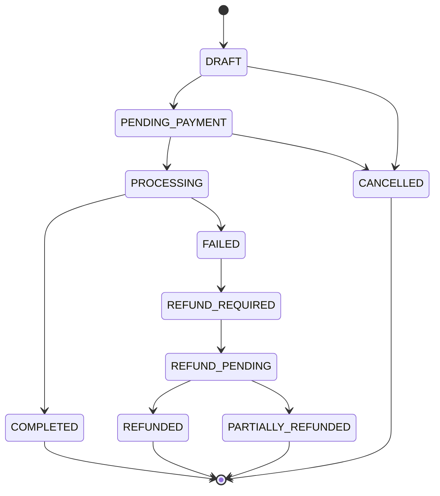
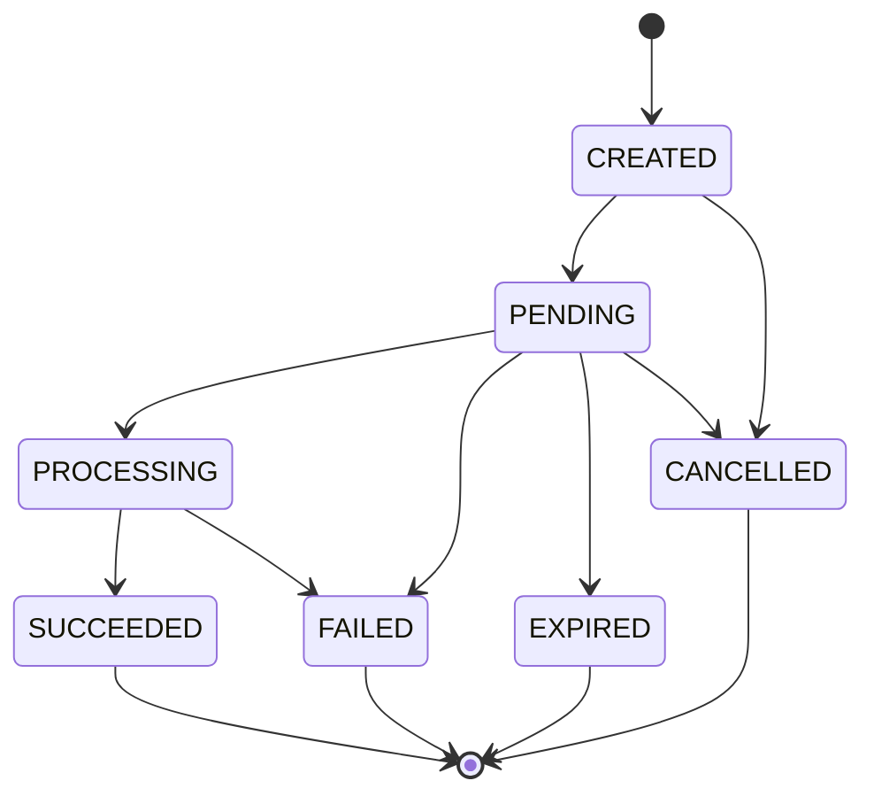
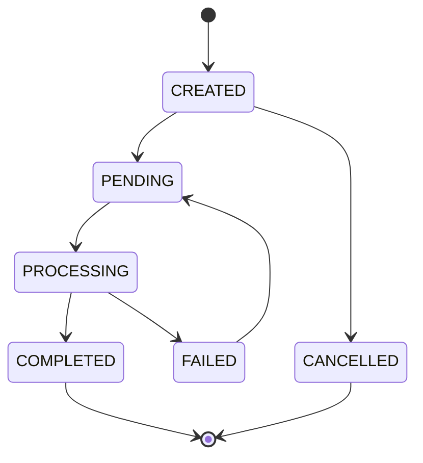
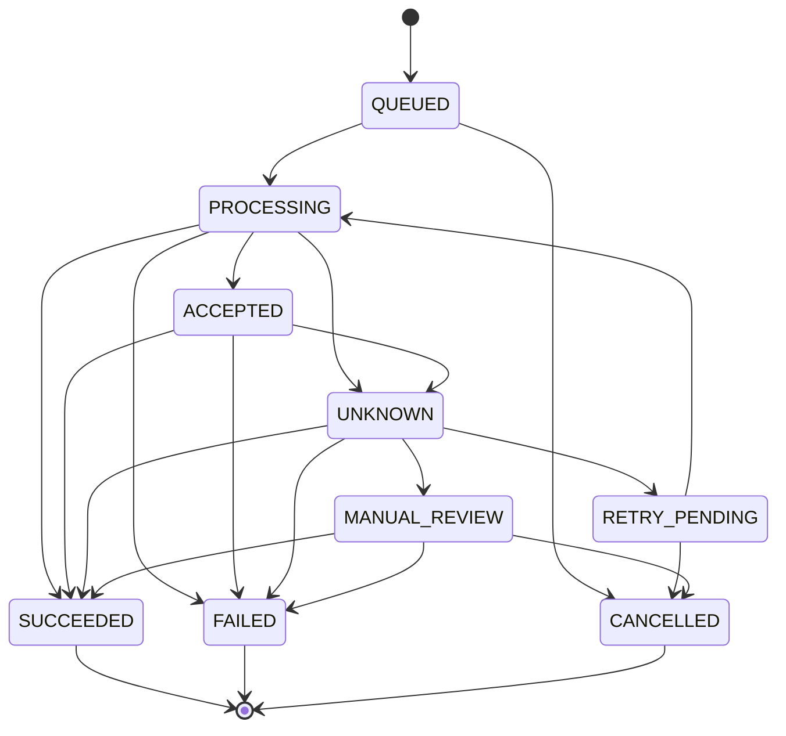
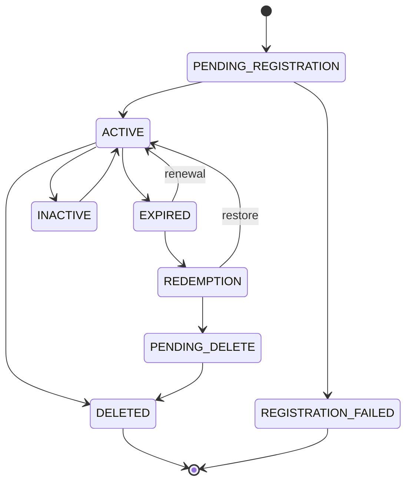
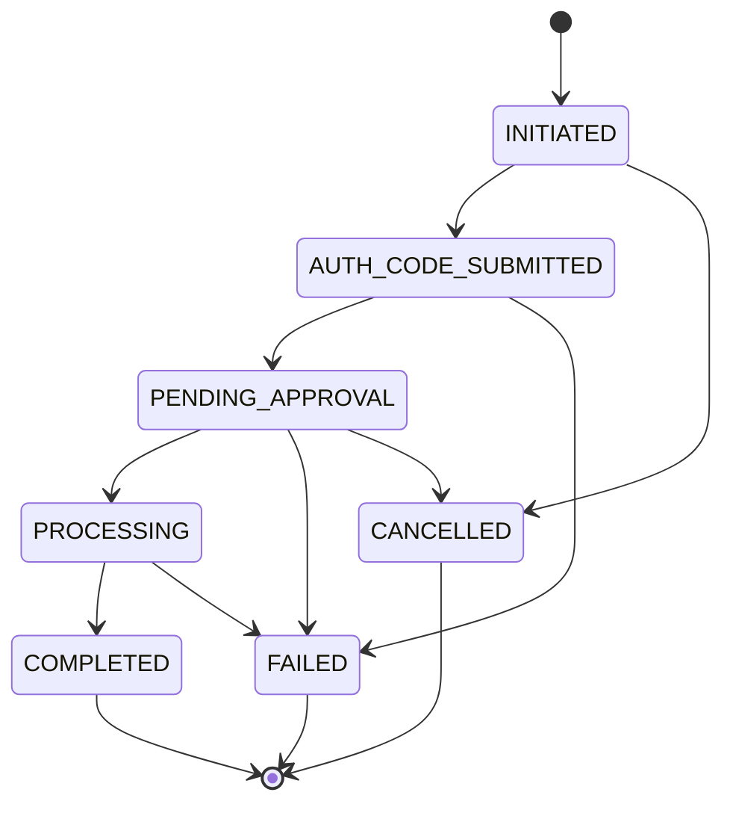

# Entity State Ownership Architecture

> Every entity owns its own lifecycle state. No entity's state transition depends on mutating another entity's state column. Aggregate customer-facing status is **derived** by reading multiple independent states, never by collapsing them into one.
>
> **Module boundary rule**: Event handlers and orchestrators NEVER directly update another module's database table. They invoke the owning domain service, which validates the transition and writes its own entity.

---

## 1. State Machines

### 1.1 OrderStatus

Owned by: `orders.status`

The order represents the customer's intent to purchase a domain operation (registration, renewal, transfer, restore). It tracks the commercial lifecycle.

```
DRAFT → PENDING_PAYMENT → PROCESSING → COMPLETED
                  ↓              ↓
              CANCELLED     FAILED → REFUND_REQUIRED → REFUND_PENDING → REFUNDED
                                                                    ↘ PARTIALLY_REFUNDED
```

| State | Description | Who sets it | Trigger |
|-------|------------|-------------|---------|
| `DRAFT` | Order created, not yet submitted for payment | OrderService | User adds item to cart / initiates checkout |
| `PENDING_PAYMENT` | Order submitted, awaiting payment confirmation | OrderService | User submits payment |
| `PROCESSING` | Payment succeeded, registrar operation dispatched | OrderService (invoked by PaymentEventHandler) | PaymentStatus → SUCCEEDED |
| `COMPLETED` | All registrar operations for this order succeeded | OrderService (invoked by RegistrarOpEventHandler) | All RegistrarOperations for this order → SUCCEEDED |
| `FAILED` | Registrar operation failed (payment was successful) | OrderService (invoked by RegistrarOpEventHandler) | RegistrarOperation → FAILED (terminal) |
| `CANCELLED` | Cancelled by user or system before payment completed | OrderService | User cancels, or payment timeout |
| `REFUND_REQUIRED` | Operation failed after successful payment; refund needed | OrderService (invoked by RegistrarOpEventHandler) | Order FAILED + Payment SUCCEEDED |
| `REFUND_PENDING` | Refund initiated | OrderService (invoked by RefundService) | Refund entity created and submitted |
| `REFUNDED` | Full refund completed | OrderService (invoked by RefundEventHandler) | RefundStatus → COMPLETED |
| `PARTIALLY_REFUNDED` | Partial refund completed (multi-item order) | OrderService (invoked by RefundEventHandler) | RefundStatus → COMPLETED for subset |

**Valid Transitions:**



---

### 1.2 PaymentStatus

Owned by: `payments.status`

Tracks the financial transaction lifecycle. **Completely independent of order/registrar outcomes.**

| State | Description | Who sets it | Trigger |
|-------|------------|-------------|---------|
| `CREATED` | Payment record created, not yet sent to gateway | PaymentService | Order transitions to PENDING_PAYMENT |
| `PENDING` | Sent to payment gateway, awaiting user action | PaymentService | Gateway session created |
| `PROCESSING` | Gateway confirms user has acted, processing | PaymentService (invoked by gateway webhook handler) | Gateway processing notification |
| `SUCCEEDED` | Payment confirmed by gateway | PaymentService (invoked by gateway webhook handler) | Gateway confirms funds captured |
| `FAILED` | Payment declined/errored | PaymentService (invoked by gateway webhook handler) | Gateway reports failure |
| `EXPIRED` | Payment session timed out | PaymentService (invoked by scheduler/gateway) | TTL exceeded |
| `CANCELLED` | User cancelled payment | PaymentService | User aborts |

**Critical Rule**: Once `SUCCEEDED`, this status NEVER changes back to FAILED or UNKNOWN regardless of what happens with the registrar operation. A successful payment is a successful payment. If the operation fails, the *order* transitions to REFUND_REQUIRED, and a new *refund* entity handles the reversal.

**Valid Transitions:**



---

### 1.3 RefundStatus

Owned by: `refunds.status`

Tracks the financial reversal lifecycle. Created only when a refund is needed.

| State | Description | Who sets it | Trigger |
|-------|------------|-------------|---------|
| `CREATED` | Refund record created | RefundService (invoked by OrderService) | Order → REFUND_REQUIRED |
| `PENDING` | Submitted to payment provider | RefundService | Admin approves or auto-refund policy |
| `PROCESSING` | Payment provider processing reversal | RefundService (invoked by gateway webhook handler) | Gateway processing |
| `COMPLETED` | Funds returned to customer | RefundService (invoked by gateway webhook handler) | Gateway confirms refund |
| `FAILED` | Refund failed at payment provider | RefundService (invoked by gateway webhook handler) | Gateway reports failure |
| `CANCELLED` | Refund cancelled (e.g., manual resolution instead) | RefundService | Admin cancels refund |

**Valid Transitions:**



---

### 1.4 RegistrarOperationStatus

Owned by: `registrar_operations.status`

Tracks a single API call to the upstream registrar (Dynadot). One order may have one or more registrar operations (e.g., register + set contacts + set nameservers).

| State | Description | Who sets it | Trigger |
|-------|------------|-------------|---------|
| `QUEUED` | Operation queued in BullMQ, not yet sent | RegistrarOperationService | Order → PROCESSING |
| `PROCESSING` | API call in flight or HTTP 202 returned | RegistrarOperationService (in worker) | BullMQ job starts executing |
| `ACCEPTED` | Provider returned 202 (async). Awaiting confirmation. | RegistrarOperationService (in worker) | Dynadot returns HTTP 202 |
| `SUCCEEDED` | Provider confirmed success (200 + valid response) | RegistrarOperationService (in worker or webhook handler) | Dynadot returns 200, or correlated webhook confirms |
| `UNKNOWN` | Provider call timed out, returned 5xx, or network error. Outcome is uncertain. | RegistrarOperationService (in worker) | Timeout, 500, 502, 503, 504, network error |
| `RETRY_PENDING` | Scheduled for retry after transient failure | RegistrarOperationService | UNKNOWN with retries remaining |
| `FAILED` | Terminal failure. Provider confirmed the operation cannot succeed. | RegistrarOperationService | 400, 402, 403, 409 (non-retryable), or max retries exhausted |
| `MANUAL_REVIEW` | Requires human intervention. Reconciliation could not resolve. | RegistrarOperationService (reconciliation job) | UNKNOWN after reconciliation attempts exhausted |
| `CANCELLED` | Operation cancelled before execution | RegistrarOperationService | Order cancelled while op was QUEUED |

**Critical Rules:**
- `UNKNOWN` is the most important state. It means "we sent the request but don't know what happened." The domain may or may not have been registered. **We must never assume success or failure.**
- `UNKNOWN` → reconciliation job polls `domain_info` / `order_get_status` to determine actual outcome.
- Transition from `UNKNOWN` → `SUCCEEDED` or `UNKNOWN` → `FAILED` happens via reconciliation or webhook, never by assumption.

**Valid Transitions:**



---

### 1.5 DomainLifecycleStatus

Owned by: `domains.lifecycle_status`

The provider-normalized lifecycle state of the domain itself. This represents **only the registration lifecycle** — not transfer activity, suspension, privacy, or lock state. Those are tracked as independent fields.

| State | Description | Source of truth |
|-------|------------|-----------------|
| `PENDING_REGISTRATION` | Registration initiated but not yet confirmed | Internal (operation dispatched) |
| `ACTIVE` | Domain is registered and functioning normally | Dynadot `domain_info` / webhook confirmation |
| `INACTIVE` | Domain exists but is not resolving (e.g., registrar hold, client hold) | Dynadot `domain_info` |
| `EXPIRED` | Domain has expired (confirmed by provider, not inferred from notifications) | Dynadot `domain_info` confirmation or `DOMAIN_STATUS_CHANGED` webhook |
| `REDEMPTION` | Domain in redemption period, restorable at cost | Dynadot `domain_info` |
| `PENDING_DELETE` | Domain past redemption, awaiting registry deletion | Dynadot `domain_info` |
| `DELETED` | Domain deleted (grace delete or registry delete) | Dynadot `domain_info` / grace_delete success |
| `REGISTRATION_FAILED` | Registration was attempted but permanently failed | RegistrarOperation → FAILED |

> [!IMPORTANT]
> **EXPIRED is set by provider confirmation only.** The `DOMAIN_EXPIRING` webhook is a *notification* that domains are approaching or past expiration. It does NOT constitute provider confirmation that the domain lifecycle has changed. On receiving `DOMAIN_EXPIRING`:
> 1. Update `domains.provider_expiration_info` with the notification data
> 2. Trigger renewal reminder logic
> 3. Optionally trigger a reconciliation call to `domain_info` to confirm current provider status
> 4. Only transition `lifecycle_status` to `EXPIRED` if provider status query confirms expiration

> [!IMPORTANT]
> **Transfer and suspension are NOT lifecycle states.** A domain can be `ACTIVE` and simultaneously have a pending transfer-out, be suspended, be transfer-locked, and have privacy enabled. These are orthogonal facts represented by independent fields, not by replacing the lifecycle status.

**Valid Transitions:**



---

### 1.6 Domain Operational Flags (Independent Fields)

These are **not part of the lifecycle state machine**. They are independent boolean/enum fields on the `domains` table that can be simultaneously true in any combination.

```sql
-- domains table: lifecycle status + independent operational flags
CREATE TABLE domains (
    id UUID PRIMARY KEY,

    -- === Lifecycle (single state machine) ===
    lifecycle_status VARCHAR(30) NOT NULL DEFAULT 'PENDING_REGISTRATION',

    -- === Independent operational flags ===
    is_suspended BOOLEAN NOT NULL DEFAULT false,
    suspension_type VARCHAR(50),          -- 'abuse', 'legal', 'compliance', 'registrar_hold'
    suspension_reason TEXT,
    suspended_at TIMESTAMPTZ,

    is_transfer_locked BOOLEAN NOT NULL DEFAULT true,  -- most domains default locked
    transfer_lock_updated_at TIMESTAMPTZ,

    privacy_level VARCHAR(20),            -- provider-normalized: 'none', 'partial', 'full'
    privacy_updated_at TIMESTAMPTZ,

    auto_renew_enabled BOOLEAN NOT NULL DEFAULT false,
    renew_option VARCHAR(30),             -- Dynadot renew_option value

    registrar_hold BOOLEAN NOT NULL DEFAULT false,  -- reseller hold at Dynadot

    -- === Provider state (raw, for reconciliation) ===
    provider_status VARCHAR(50),          -- raw Dynadot status string, not normalized
    provider_expiration_info JSONB,       -- raw expiration data from DOMAIN_EXPIRING webhook

    -- === Ownership ===
    registrar_provider_id UUID NOT NULL REFERENCES registrar_providers(id),
    provider_domain_id VARCHAR(255),

    -- === Timestamps ===
    registered_at TIMESTAMPTZ,
    expires_at TIMESTAMPTZ,
    created_at TIMESTAMPTZ NOT NULL DEFAULT now(),
    updated_at TIMESTAMPTZ NOT NULL DEFAULT now(),
    deleted_at TIMESTAMPTZ,

    ...
);
```

**Representable composite states (examples):**

| lifecycle_status | is_suspended | is_transfer_locked | privacy_level | Meaning |
|-----------------|-------------|-------------------|--------------|---------|
| ACTIVE | false | true | full | Normal domain, locked, privacy on |
| ACTIVE | true | true | full | Active but suspended (abuse hold) |
| ACTIVE | false | false | none | Active, unlocked for transfer-out, no privacy |
| EXPIRED | true | true | full | Expired and suspended simultaneously |
| EXPIRED | false | false | none | Expired, unlocked (ready for transfer or drop) |

---

### 1.7 TransferStatus

Owned by: `transfers.status`

Tracks the specific multi-step transfer workflow. Only created for transfer-in and transfer-out operations. The domain's `lifecycle_status` does NOT change to reflect transfer activity — transfer is tracked entirely here.

| State | Description |
|-------|------------|
| `INITIATED` | Transfer request created internally |
| `AUTH_CODE_SUBMITTED` | Auth/EPP code submitted to gaining registrar |
| `PENDING_APPROVAL` | Awaiting losing registrar approval (5-day EPP window) |
| `PROCESSING` | Registrar is processing the transfer |
| `COMPLETED` | Transfer completed successfully |
| `FAILED` | Transfer failed (rejected, expired, auth code invalid) |
| `CANCELLED` | Transfer cancelled by user or admin |

**Valid Transitions:**



**How transfer-in completion affects the domain:**
When `TransferStatus → COMPLETED` for a transfer-in, the transfer event handler invokes `DomainService.activateAfterTransfer(domainId)`, which:
1. Sets `lifecycle_status = ACTIVE`
2. Updates `registered_at`, `expires_at` from provider data
3. Updates `provider_domain_id` and `registrar_provider_id`

For transfer-out, the `DOMAIN_TRANSFER_AWAY` webhook handler invokes `DomainService.markTransferredAway(domainId)`, which:
1. Sets `lifecycle_status = DELETED` (domain no longer under our management)
2. Records the gaining registrar in `domain_events`

---

## 2. Database Schema (State Columns)

Each entity owns its status column independently:

```sql
-- Orders
CREATE TABLE orders (
    id UUID PRIMARY KEY,
    status VARCHAR(30) NOT NULL DEFAULT 'DRAFT',
    -- CHECK (status IN ('DRAFT', 'PENDING_PAYMENT', 'PROCESSING', 'COMPLETED',
    --   'FAILED', 'CANCELLED', 'REFUND_REQUIRED', 'REFUND_PENDING',
    --   'REFUNDED', 'PARTIALLY_REFUNDED'))
    ...
);

-- Payments (one order may have multiple payment attempts)
CREATE TABLE payments (
    id UUID PRIMARY KEY,
    order_id UUID NOT NULL REFERENCES orders(id),
    status VARCHAR(20) NOT NULL DEFAULT 'CREATED',
    -- CHECK (status IN ('CREATED', 'PENDING', 'PROCESSING', 'SUCCEEDED',
    --   'FAILED', 'EXPIRED', 'CANCELLED'))
    ...
);

-- Refunds (created only when needed)
CREATE TABLE refunds (
    id UUID PRIMARY KEY,
    order_id UUID NOT NULL REFERENCES orders(id),
    payment_id UUID NOT NULL REFERENCES payments(id),
    status VARCHAR(20) NOT NULL DEFAULT 'CREATED',
    -- CHECK (status IN ('CREATED', 'PENDING', 'PROCESSING', 'COMPLETED',
    --   'FAILED', 'CANCELLED'))
    ...
);

-- Registrar Operations (one order may dispatch multiple ops)
CREATE TABLE registrar_operations (
    id UUID PRIMARY KEY,
    order_id UUID REFERENCES orders(id),
    domain_id UUID REFERENCES domains(id),
    status VARCHAR(20) NOT NULL DEFAULT 'QUEUED',
    -- CHECK (status IN ('QUEUED', 'PROCESSING', 'ACCEPTED', 'SUCCEEDED',
    --   'UNKNOWN', 'RETRY_PENDING', 'FAILED', 'MANUAL_REVIEW', 'CANCELLED'))
    operation_type VARCHAR(30) NOT NULL,  -- 'REGISTER', 'RENEW', 'TRANSFER_IN', 'RESTORE', etc.
    provider_request_id UUID,       -- X-Request-ID sent to Dynadot
    provider_order_id INTEGER,      -- Dynadot's order_id if returned
    provider_response_code INTEGER, -- HTTP status code
    provider_response_raw JSONB,    -- raw response for debugging (encrypted, access-controlled)
    retry_count INTEGER NOT NULL DEFAULT 0,
    max_retries INTEGER NOT NULL DEFAULT 3,
    last_error TEXT,
    ...
);

-- Domains (lifecycle + independent operational flags)
CREATE TABLE domains (
    id UUID PRIMARY KEY,
    lifecycle_status VARCHAR(30) NOT NULL DEFAULT 'PENDING_REGISTRATION',
    -- CHECK (lifecycle_status IN ('PENDING_REGISTRATION', 'ACTIVE', 'INACTIVE',
    --   'EXPIRED', 'REDEMPTION', 'PENDING_DELETE', 'DELETED', 'REGISTRATION_FAILED'))

    -- Independent operational flags
    is_suspended BOOLEAN NOT NULL DEFAULT false,
    suspension_type VARCHAR(50),
    suspension_reason TEXT,
    suspended_at TIMESTAMPTZ,
    is_transfer_locked BOOLEAN NOT NULL DEFAULT true,
    transfer_lock_updated_at TIMESTAMPTZ,
    privacy_level VARCHAR(20),
    privacy_updated_at TIMESTAMPTZ,
    auto_renew_enabled BOOLEAN NOT NULL DEFAULT false,
    renew_option VARCHAR(30),
    registrar_hold BOOLEAN NOT NULL DEFAULT false,

    -- Provider state
    provider_status VARCHAR(50),
    provider_expiration_info JSONB,

    registrar_provider_id UUID NOT NULL REFERENCES registrar_providers(id),
    provider_domain_id VARCHAR(255),
    ...
);

-- Transfers (only for transfer operations)
CREATE TABLE transfers (
    id UUID PRIMARY KEY,
    domain_id UUID REFERENCES domains(id),
    order_id UUID REFERENCES orders(id),
    registrar_operation_id UUID REFERENCES registrar_operations(id),
    status VARCHAR(30) NOT NULL DEFAULT 'INITIATED',
    -- CHECK (status IN ('INITIATED', 'AUTH_CODE_SUBMITTED', 'PENDING_APPROVAL',
    --   'PROCESSING', 'COMPLETED', 'FAILED', 'CANCELLED'))
    direction VARCHAR(10) NOT NULL,  -- 'IN' or 'OUT'
    auth_code_hash VARCHAR(255),     -- hashed, never stored plaintext
    ...
);
```

---

## 3. Entity Interaction Diagram

```
┌──────────────────────────────────────────────────────────────────┐
│                     Entity Ownership Map                         │
├──────────────────────────────────────────────────────────────────┤
│                                                                  │
│  ┌─────────┐    owns    ┌──────────┐    owns    ┌────────────┐  │
│  │  ORDER  │───────────▶│ PAYMENT  │───────────▶│   REFUND   │  │
│  │ .status │            │  .status │            │   .status  │  │
│  └────┬────┘            └──────────┘            └────────────┘  │
│       │                                                          │
│       │ dispatches                                               │
│       ▼                                                          │
│  ┌────────────────┐     invokes     ┌──────────────────────┐    │
│  │   REGISTRAR    │────────────────▶│       DOMAIN         │    │
│  │   OPERATION    │   owning svc    │ .lifecycle_status    │    │
│  │    .status     │                 │ .is_suspended        │    │
│  └────────────────┘                 │ .is_transfer_locked  │    │
│                                     │ .privacy_level       │    │
│                                     │ .auto_renew_enabled  │    │
│                                     │ .registrar_hold      │    │
│                                     └────────┬─────────────┘    │
│                                              │                   │
│                                              │ may create        │
│                                              ▼                   │
│                                        ┌──────────┐             │
│                                        │ TRANSFER │             │
│                                        │  .status │             │
│                                        └──────────┘             │
│                                                                  │
│  ─────────────────────────────────────────────────────────────── │
│  RULES:                                                          │
│  1. No entity mutates another entity's state column              │
│  2. Cross-entity updates go through the OWNING SERVICE           │
│  3. The owning service validates the transition before writing   │
│  4. Event handlers invoke services, not SQL                      │
└──────────────────────────────────────────────────────────────────┘
```

### Module Boundary Enforcement

**How event handlers invoke owning services (never direct DB writes):**

```typescript
// ✅ CORRECT: handler invokes owning services
class RegistrarOpEventHandler {
  constructor(
    private readonly domainService: DomainService,
    private readonly orderService: OrderService,
  ) {}

  async onRegistrationSucceeded(event: RegistrarOpSucceededEvent) {
    // Handler does NOT write to domains table directly.
    // It invokes DomainService, which owns the domains table.
    await this.domainService.activate(event.domainId, {
      expiresAt: event.expirationDate,
      providerDomainId: event.providerDomainId,
    });

    // Handler invokes OrderService, which owns the orders table.
    await this.orderService.completeIfAllOpsSucceeded(event.orderId);
  }
}

// ❌ WRONG: handler writes to another module's table
class RegistrarOpEventHandler {
  async onRegistrationSucceeded(event: RegistrarOpSucceededEvent) {
    // NEVER do this — violates module ownership
    await this.db.update(domains)
      .set({ lifecycle_status: 'ACTIVE' })
      .where(eq(domains.id, event.domainId));
  }
}
```

---

## 4. Webhook Event Correlation & Processing

### 4.1 ORDER_COMPLETED Webhook

The Dynadot `ORDER_COMPLETED` webhook is **NOT a universal signal** to set all entities to success. It must be correlated and processed according to operation type.

**Processing flow:**

```
ORDER_COMPLETED webhook arrives
  → Verify X-Signature
  → Extract provider order_id from event.data.order_id
  → Deduplicate via event_id in webhook_events table
  → Correlate: find registrar_operations WHERE provider_order_id = event.data.order_id
  → For each matched operation, process by operation_type:

    REGISTER:
      → Verify registration via domain_info call (confirm domain exists at provider)
      → If confirmed: registrarOperationService.succeed(opId)
                       → domainService.activate(domainId, { expiresAt, ... })
                       → orderService.completeIfAllOpsSucceeded(orderId)
      → If not confirmed: log warning, schedule reconciliation

    RENEW:
      → Extract new expiration_date from event.data
      → Verify via domain_info call (confirm new expiry)
      → registrarOperationService.succeed(opId)
      → domainService.updateExpiration(domainId, newExpiresAt)
      → orderService.completeIfAllOpsSucceeded(orderId)
      → Domain lifecycle_status remains ACTIVE (renewal doesn't change lifecycle)

    TRANSFER_IN:
      → Verify transfer completion via get_transfer_status
      → registrarOperationService.succeed(opId)
      → transferService.complete(transferId)
      → domainService.activateAfterTransfer(domainId, { expiresAt, ... })
      → orderService.completeIfAllOpsSucceeded(orderId)

    RESTORE:
      → Verify restore via domain_info (confirm domain is out of redemption)
      → registrarOperationService.succeed(opId)
      → domainService.activate(domainId, { expiresAt, ... })
        (lifecycle: REDEMPTION → ACTIVE)
      → orderService.completeIfAllOpsSucceeded(orderId)
```

### 4.2 DOMAIN_EXPIRING Webhook

**NOT a lifecycle transition trigger.** Processing flow:

```
DOMAIN_EXPIRING webhook arrives
  → Verify X-Signature
  → Deduplicate via event_id
  → Parse expiration buckets:
      domains_expired_after_30_days
      domains_expired_after_10_days
      domains_expired_after_3_days
      domains_expired_today
      domains_redemption
  → For each domain in notification:
      → domainService.updateProviderExpirationInfo(domainId, notificationData)
        (writes to domains.provider_expiration_info JSONB field)
      → notificationService.triggerRenewalReminder(domainId, urgencyLevel)
      → OPTIONALLY: reconciliationService.scheduleStatusCheck(domainId)
        (calls domain_info at Dynadot to confirm actual provider status)
  → Do NOT transition lifecycle_status to EXPIRED based on this webhook alone
  → lifecycle_status → EXPIRED only if/when reconciliation confirms via domain_info
```

### 4.3 DOMAIN_STATUS_CHANGED Webhook

This webhook carries confirmed provider state changes and CAN trigger lifecycle transitions:

```
DOMAIN_STATUS_CHANGED webhook arrives
  → Verify X-Signature
  → Deduplicate via event_id
  → Extract: domain, change_type, expiration, status
  → Correlate to internal domain record
  → domainService.reconcileProviderStatus(domainId, {
      changeType: event.data.change_type,
      providerStatus: event.data.status,
      expiration: event.data.expiration,
    })
  → DomainService internally maps provider status to lifecycle_status transition:
      e.g., provider "expired" → lifecycle_status = EXPIRED (provider-confirmed)
```

### 4.4 DOMAIN_SUSPENSION_STATUS_CHANGED Webhook

Updates the **independent suspension flag**, not the lifecycle status:

```
DOMAIN_SUSPENSION_STATUS_CHANGED webhook arrives
  → Verify X-Signature
  → Deduplicate
  → domainService.updateSuspensionStatus(domainId, {
      suspended: event.data.suspended,
      suspensionType: event.data.suspension_type,
      reason: event.data.reason,
      message: event.data.message,
      timestamp: event.data.status_changed_timestamp,
    })
  → DomainService writes:
      domains.is_suspended = event.data.suspended
      domains.suspension_type = event.data.suspension_type
      domains.suspension_reason = event.data.reason
      domains.suspended_at = timestamp (if suspended)
  → lifecycle_status is NOT changed (domain can be ACTIVE + suspended)
```

---

## 5. Interaction Flows (With Module Boundary Enforcement)

### Flow 1: Successful Registration

```
1. User creates order          → orderService.create()
                                  Order.status = DRAFT

2. User initiates payment      → orderService.submitForPayment()
                                  Order.status = PENDING_PAYMENT
                                → paymentService.create(orderId)
                                  Payment.status = CREATED

3. Payment gateway processes   → paymentService.markProcessing(paymentId)
                                  Payment.status = PROCESSING

4. Payment succeeds            → paymentService.markSucceeded(paymentId)
                                  Payment.status = SUCCEEDED
                                  ↳ Emits: PaymentSucceededEvent

5. PaymentEventHandler reacts  → orderService.markProcessing(orderId)
                                  Order.status = PROCESSING
                               → registrarOperationService.enqueue(orderId, domainId, 'REGISTER')
                                  RegistrarOperation.status = QUEUED
                               → domainService.markPendingRegistration(domainId)
                                  Domain.lifecycle_status = PENDING_REGISTRATION

6. Worker picks up job         → registrarOperationService.markProcessing(opId)
                                  RegistrarOperation.status = PROCESSING

7. Dynadot returns 200         → registrarOperationService.markSucceeded(opId, responseData)
                                  RegistrarOperation.status = SUCCEEDED
                                  ↳ Emits: RegistrarOpSucceededEvent

8. RegistrarOpEventHandler     → domainService.activate(domainId, { expiresAt })
                                  Domain.lifecycle_status = ACTIVE
                               → orderService.completeIfAllOpsSucceeded(orderId)
                                  Order.status = COMPLETED
```

### Flow 2: Registration with Dynadot Timeout (UNKNOWN)

```
1-5. Same as Flow 1 through RegistrarOperation.status = QUEUED

6. Worker picks up job         → registrarOperationService.markProcessing(opId)
                                  RegistrarOperation.status = PROCESSING

7. Dynadot times out           → registrarOperationService.markUnknown(opId, errorDetails)
                                  RegistrarOperation.status = UNKNOWN
                                  ↳ Domain.lifecycle_status remains PENDING_REGISTRATION
                                  ↳ Order.status remains PROCESSING
                                  ↳ Payment.status remains SUCCEEDED  ← IMMUTABLE

8. Reconciliation job runs     → Polls domain_info at Dynadot

   8a. Domain exists           → registrarOperationService.markSucceeded(opId)
                                  ↳ RegistrarOpSucceededEvent → same as Flow 1 step 8

   8b. Domain does not exist   → registrarOperationService.markRetryPending(opId)
                                  RegistrarOperation.status = RETRY_PENDING
                                  ↳ Re-enqueue job → back to step 6

   8c. After max retries       → registrarOperationService.markFailed(opId)
                                  RegistrarOperation.status = FAILED
                                  ↳ Emits: RegistrarOpFailedEvent
                               → domainService.markRegistrationFailed(domainId)
                                  Domain.lifecycle_status = REGISTRATION_FAILED
                               → orderService.markFailed(orderId)
                                  Order.status = FAILED → REFUND_REQUIRED
                               → refundService.create(orderId, paymentId)
                                  Refund.status = CREATED
```

### Flow 3: Renewal via ORDER_COMPLETED Webhook

```
1-5. Same payment flow, operation_type = 'RENEW'

6. Worker sends renewal        → Dynadot returns 200
                                  RegistrarOperation.status = SUCCEEDED

7. OR: ORDER_COMPLETED webhook arrives later
   → webhookHandler.processOrderCompleted(event)
   → Correlate to registrar_operation WHERE provider_order_id = event.order_id
   → registrarOperationService.succeed(opId)  // if not already SUCCEEDED
   → domainService.updateExpiration(domainId, newExpiresAt)
     Domain.lifecycle_status = ACTIVE  // unchanged, renewal doesn't change lifecycle
     Domain.expires_at = newExpiresAt  // updated
   → orderService.completeIfAllOpsSucceeded(orderId)
     Order.status = COMPLETED
```

### Flow 4: Transfer-In (Async 202)

```
1-5. Same payment flow, operation_type = 'TRANSFER_IN'

6. Worker sends transfer_in    → Dynadot returns 202
   → registrarOperationService.markAccepted(opId)
     RegistrarOperation.status = ACCEPTED
   → transferService.markPendingApproval(transferId)
     Transfer.status = PENDING_APPROVAL
   → Domain.lifecycle_status remains PENDING_REGISTRATION (or could be ACTIVE if was
     previously registered elsewhere — depends on whether domain record pre-exists)

7. ORDER_COMPLETED webhook for transfer:
   → Correlate to registrar_operation + transfer
   → Verify via get_transfer_status (confirm transfer completed)
   → registrarOperationService.succeed(opId)
   → transferService.complete(transferId)
     Transfer.status = COMPLETED
   → domainService.activateAfterTransfer(domainId, { expiresAt, providerDomainId })
     Domain.lifecycle_status = ACTIVE
   → orderService.completeIfAllOpsSucceeded(orderId)
     Order.status = COMPLETED
```

---

## 6. Deriving Customer-Facing Order Status

The customer sees a **single aggregate status** on their order, but it is **computed at read time** from the independent entity states, never stored as a combined column.

```typescript
// packages/registrar-core/src/services/order-status-derived.service.ts

function deriveCustomerFacingStatus(
  order: { status: OrderStatus },
  payment: { status: PaymentStatus } | null,
  operations: { status: RegistrarOperationStatus }[],
  refund: { status: RefundStatus } | null,
): CustomerFacingOrderStatus {

  // Terminal states are authoritative
  if (order.status === 'CANCELLED') return 'Cancelled';
  if (order.status === 'REFUNDED') return 'Refunded';
  if (order.status === 'PARTIALLY_REFUNDED') return 'Partially Refunded';

  // Refund in progress
  if (order.status === 'REFUND_REQUIRED' || order.status === 'REFUND_PENDING')
    return 'Refund in Progress';

  // Not yet paid
  if (order.status === 'DRAFT') return 'Draft';
  if (order.status === 'PENDING_PAYMENT') return 'Awaiting Payment';

  // Payment failed
  if (payment?.status === 'FAILED') return 'Payment Failed';
  if (payment?.status === 'EXPIRED') return 'Payment Expired';

  // Processing: payment succeeded, registrar working
  if (order.status === 'PROCESSING') {
    const hasManualReview = operations.some(op => op.status === 'MANUAL_REVIEW');
    if (hasManualReview) return 'Under Review';
    return 'Processing';
  }

  if (order.status === 'COMPLETED') return 'Completed';
  if (order.status === 'FAILED') return 'Failed';

  return 'Processing';  // safe default
}
```

**Customer-facing statuses** (what the user sees in their dashboard):

| Customer Status | Underlying States |
|----------------|-------------------|
| **Draft** | Order=DRAFT |
| **Awaiting Payment** | Order=PENDING_PAYMENT |
| **Payment Failed** | Payment=FAILED |
| **Payment Expired** | Payment=EXPIRED |
| **Processing** | Order=PROCESSING, Payment=SUCCEEDED, Ops in QUEUED/PROCESSING/ACCEPTED/UNKNOWN/RETRY_PENDING |
| **Completed** | Order=COMPLETED |
| **Under Review** | Any op in MANUAL_REVIEW |
| **Failed** | Order=FAILED |
| **Refund in Progress** | Order=REFUND_REQUIRED or REFUND_PENDING |
| **Refunded** | Order=REFUNDED |
| **Partially Refunded** | Order=PARTIALLY_REFUNDED |
| **Cancelled** | Order=CANCELLED |

---

## 7. State Transition Ownership Summary

| Entity | Owning Service | Writes via | Never written by |
|--------|---------------|-----------|-----------------|
| `orders.status` | `OrderService` | OrderService methods only | PaymentService, RegistrarOperationService, DomainService, RefundService |
| `payments.status` | `PaymentService` | PaymentService methods only | OrderService, RegistrarOperationService |
| `refunds.status` | `RefundService` | RefundService methods only | OrderService, PaymentService |
| `registrar_operations.status` | `RegistrarOperationService` | RegistrarOperationService methods only | OrderService, DomainService |
| `domains.lifecycle_status` | `DomainService` | DomainService methods only | OrderService, RegistrarOperationService |
| `domains.is_suspended` | `DomainService` | DomainService methods only | Webhook handlers invoke DomainService |
| `domains.is_transfer_locked` | `DomainService` | DomainService methods only | Webhook handlers invoke DomainService |
| `domains.privacy_level` | `DomainService` | DomainService methods only | |
| `transfers.status` | `TransferService` | TransferService methods only | RegistrarOperationService, DomainService |

**Invariant**: A service that handles events for entity A may *read* entity B's status to make decisions, but it only *writes* to entity A's status column by invoking entity A's owning service. The owning service validates the state transition before committing.
